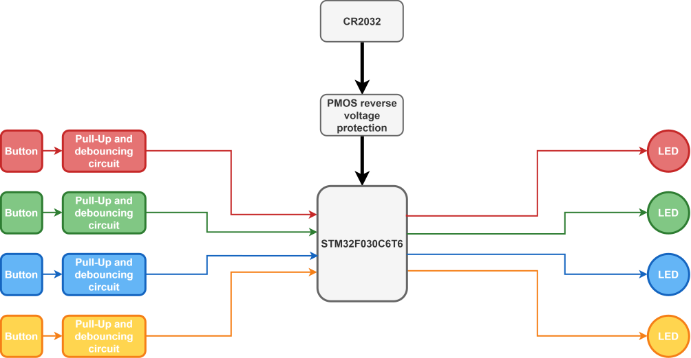

# Simon_pocket – A pocket version of the classic Simon says game

A pocket sized memory training game 
The Simon_pocket is a pocked sized memory training game designed for on-the-go 

---

## 🎯 Constraints and design considerations

- **Battery selection:** the CR2032 was chosen due to compatible nominal voltage (3V), compact size, wide adoption
- **Lack of sound:** buzzers/speakers had to be omitted due to high internal resistance of the battery
- **Power Budget:** the MCU had to operate mostly STOP mode to lower standby current to 6uA ensuring battery life for multiple years
- **Key Specs:**
  - **Main Controller:** STM32G431KB (Arm Cortex-M4 @ 170MHz)
  - **Power Subsystem:** Buck-Boost regulator (3.3V–12V input -> 5V @ 2A output)
  - **PCB Specs:** 4-layer FR4, 1/1/1/1 oz Cu, 1.6mm thickness, controlled 50Ω impedance traces
---

## Conponent selection

- **Battery:** The CR2032 was chosen due to compatible nominal voltage (3V), compact size and accessibility.
- **Sound system:** Buzzers/speakers had to be omitted due to high internal resistance of the battery
- **Microcontroller:** The STM32F030C6T6 was chosen for being inexpensive (0.5€ @ 30+ Qty) and having good documentation and support
- **Power system:** Due to space constraints, a dedicated power button was not possible. Every button is configured to wake up the MCU from STOP mode
---

## 🏗️ Hardware Architecture

---

## 📐 PCB Design & Layout Details

### Layer Stackup (2-Layer)
1. **Top (Signal / Power):** MCU, LED and button traces. Power distribution.
2. **Bottom (Ground / Power):** Negative battery contact. Power distribution.

### Key Layout Highlights
- **High-Speed USB:** Routed as 90Ω differential pairs with matched lengths (within ±0.1mm tolerance).
- **Analog Isolation:** Dedicated analog ground region connected to digital GND at a single star-ground point near the ADC.
- **Thermal Design:** Thermal vias placed under the main regulator to sink heat into internal copper planes.

---

## 🧪 Validation & Test Results

- **Power Ripple Test:** 3.3V rail ripple measured under 15mV peak-to-peak at full 1.5A load.
- **Thermal Performance:** Max board temp reached 48°C under full load after 1 hour ambient testing.
- **Signal Integrity:** USB 2.0 full-speed eye diagram verified clean with minimal jitter.

---

## 🛠️ Design Iterations & Lessons Learned

- **Rev A Bug:** Ground plane beneath the RF antenna was not properly cleared, degrading wireless range by ~40%.
- **Rev B Fix:** Added antenna cutout area according to datasheet guidelines, restoring expected range.
- **Trade-off:** Chose QFN over BGA components to allow manual hot-air rework on a bench without X-ray inspection.

---

## 🧰 Tools & Software Used

- **EDA:** KiCad 10.0
- **Simulation:** LTspice (Power supply ripple & transient response)
- **Measurement:** Siglent SDS1104X-E Oscilloscope, Saleae Logic Pro 8
