# Simon_pocket – A pocket version of the classic Simon says game

  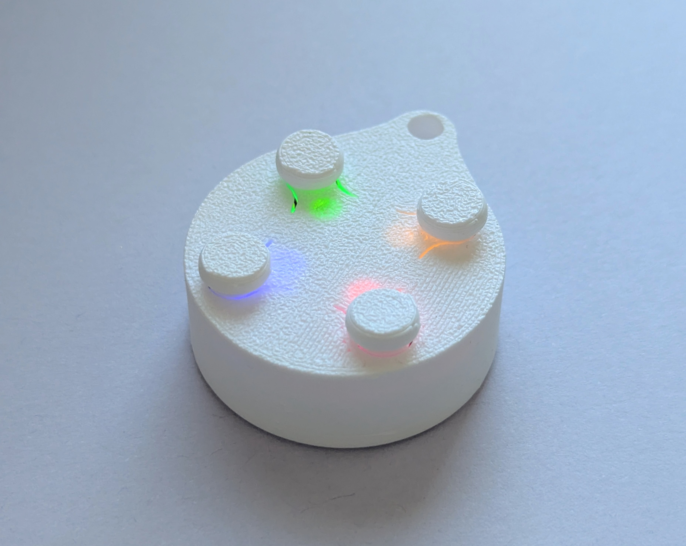

**Simon_pocket is a pocked sized memory training game. Players have to repeat a button sequence that gets longer each round. The project includes a custom PCB, bare metal programming for an STM32 MCU and a 3D printed housing.**

---

## Gameplay

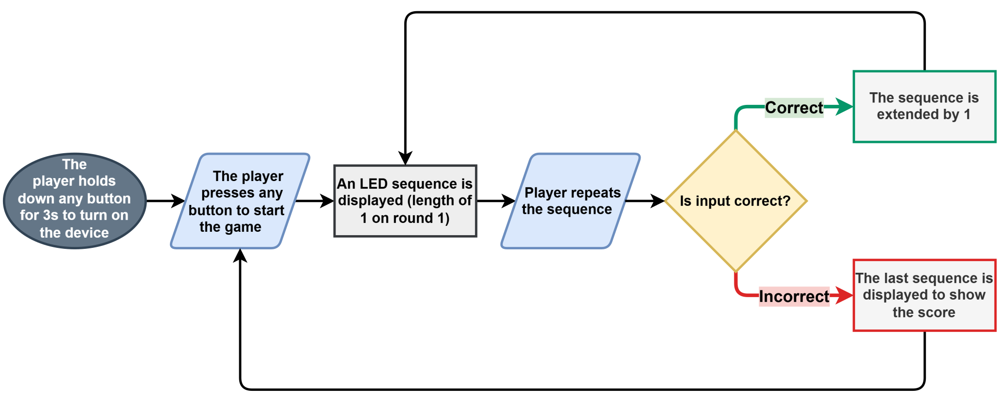

---

## Hardware Architecture

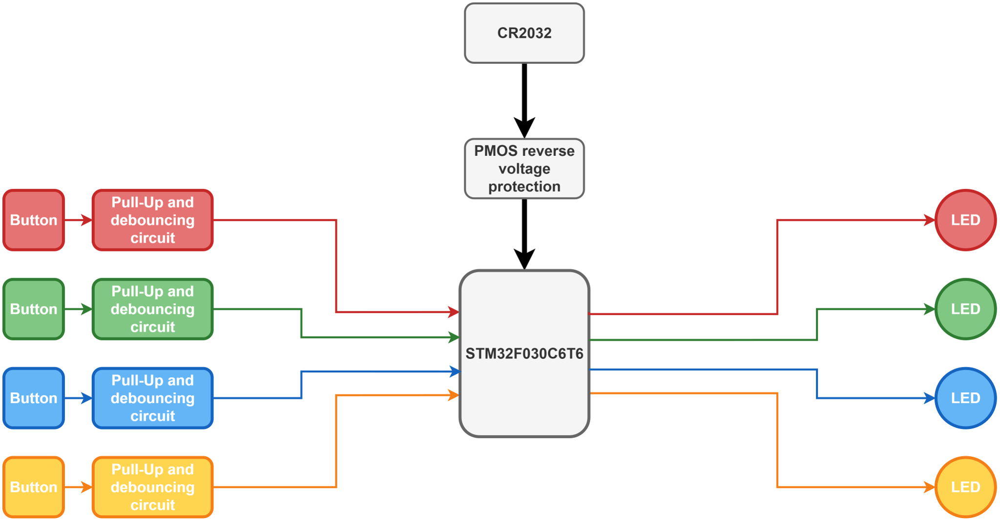

---

## Conponent Selection and Design Considerations

- **Microcontroller:** The STM32F030C6T6 was chosen for being inexpensive (0.5€ @ 30+ Qty) and having good documentation and support.
- **Battery:** The CR2032 was selected because of the 3V nominal voltage, compact size and availability.
- **Sound system:** Buzzers/speakers had to be omitted due to the high internal resistance of the battery.
- **Power on:** Due to space constraints, a dedicated power button was not possible. Instead, every button is configured to wake up the MCU from STOP mode.
- **Size:** The PCB diameter of 27mm was selected for being the smallest diameter that could fit the battery holder.
- **Standby current:** To minimize standby current:
  - A low leakage curent PMOS was selected.
  - No LDOs or switching regulators were used.
  - The MCU operates mostly in STOP power saving mode.

---

## PCB Design & Layout Details

  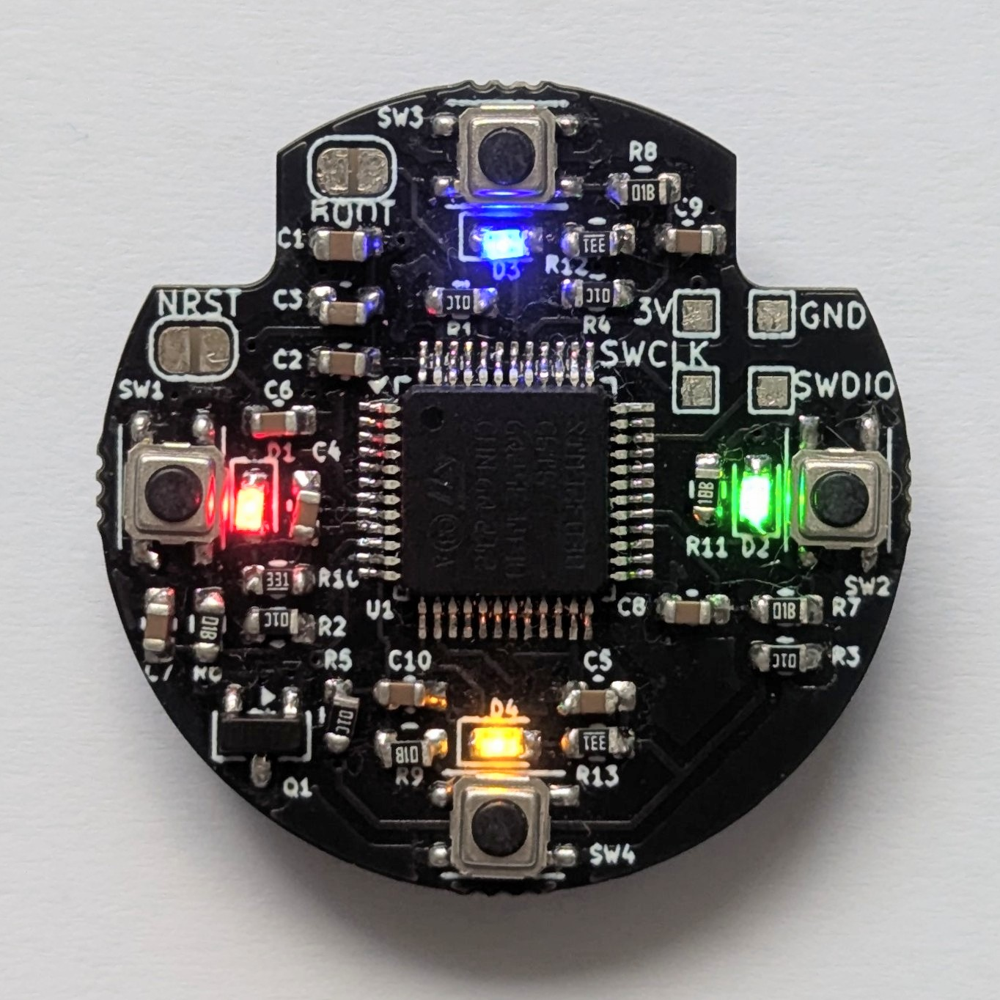
  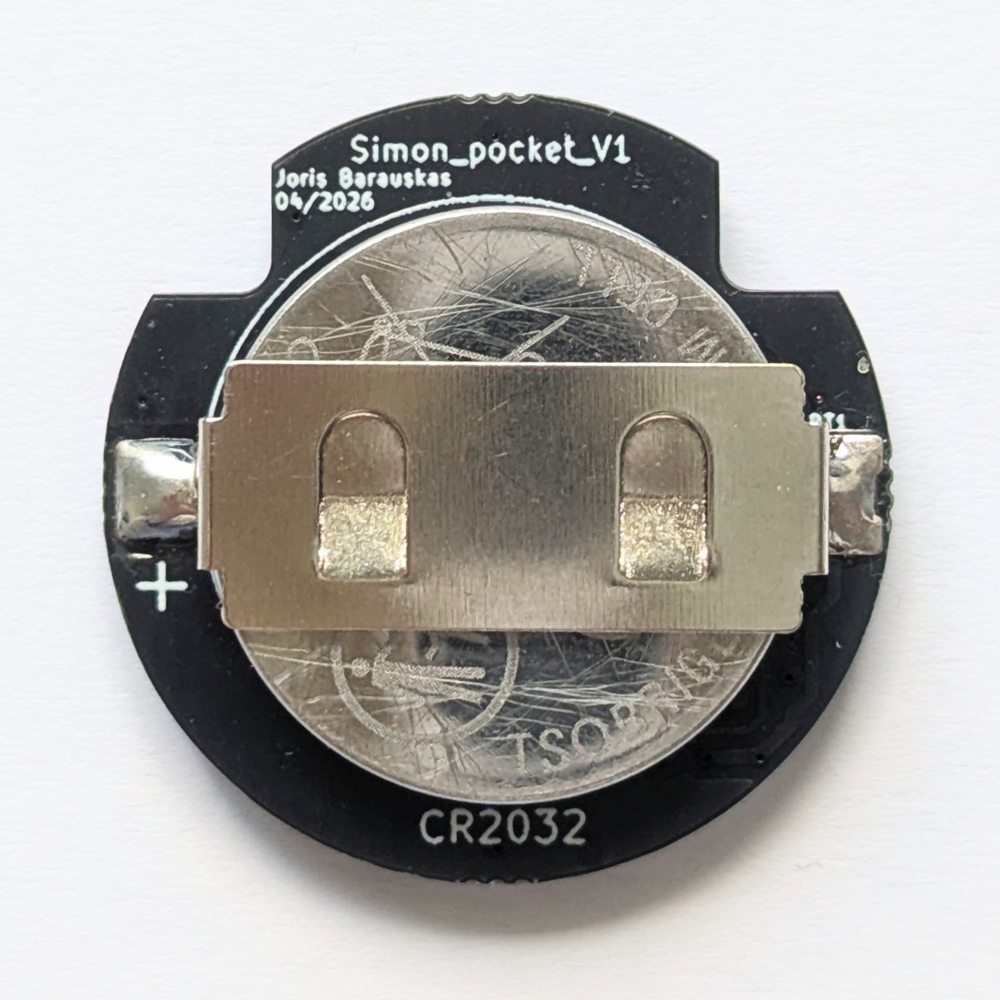

  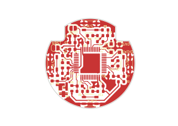
  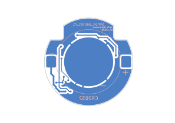

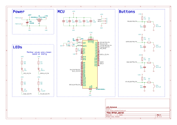
### Layer Stackup (2-Layer)
1. **Top (Signal / Power):** MCU, LED and button traces. Power distribution.
2. **Bottom (Ground / Power):** Negative battery contact and ground plane. Power distribution.

### Key Layout Highlights
- **High-Speed USB:** Routed as 90Ω differential pairs with matched lengths (within ±0.1mm tolerance).
- **Analog Isolation:** Dedicated analog ground region connected to digital GND at a single star-ground point near the ADC.
- **Thermal Design:** Thermal vias placed under the main regulator to sink heat into internal copper planes.

---

## Programming
The code was written in bare metal CMSIS C using the STM32CubeIDE. To upload the code an ST-LINK V2 has to be connected to the programming contacts on the PCB.

### Code structure
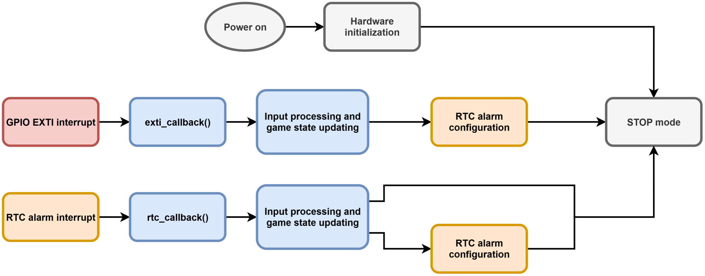

### State machine transitions
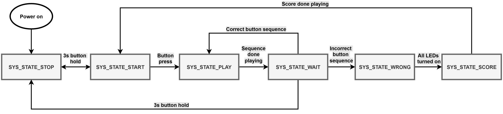

---
## 3D modeling and printing
The housing was modeled using Autodesk Fusion. It was printed using the Bambu Lab A1 mini 3D printer.
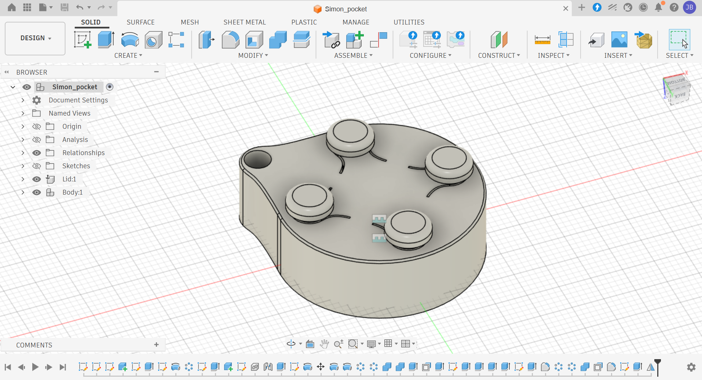
---

## 🧪 Validation & Test Results

- **Power Ripple Test:** 3.3V rail ripple measured under 15mV peak-to-peak at full 1.5A load.
- **Thermal Performance:** Max board temp reached 48°C under full load after 1 hour ambient testing.
- **Signal Integrity:** USB 2.0 full-speed eye diagram verified clean with minimal jitter.

---

## 🧰 Tools & Software Used

- **EDA:** KiCad 10.0
- **Simulation:** LTspice (Power supply ripple & transient response)
- **Measurement:** Siglent SDS1104X-E Oscilloscope, Saleae Logic Pro 8
